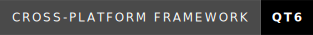

<div align="center">

# Garlic Decompiler (GUI)


**A modern C++/Qt6 GUI front-end for the Garlic Decompiler — bringing blazing-fast APK/DEX/JAR/CLASS decompilation power to your desktop.**

[](LICENSE)
[](#built-with)
[](https://www.qt.io/)

</div>

---

## Table of Contents

* [About The Project](#about-the-project)
  * [Key Features](#key-features)
  * [Built With](#built-with)
  * [Project Structure](#project-structure)
* [Getting Started](#getting-started)
  * [Prerequisites](#prerequisites)
  * [Installation](#installation)
* [Roadmap](#roadmap)
* [Contributing](#contributing)
* [License](#license)
* [Contact](#contact)
* [Acknowledgments](#acknowledgments)
* [TL;DR](#tldr)
  * [Usage](#usage)

---

## About The Project

**Garlic Decompiler GUI** is a modern C++/Qt6 graphical interface for the [Garlic Decompiler](https://github.com/neocanable/garlic). It allows you to:

* Open, decompile, browse, and export Java source code from Android/Java binaries seamlessly.
* Work with APK, DEX, JAR, and CLASS files at lightning speed.
* Navigate projects using a beautiful, **VS Code Dark 2026** inspired tabbed editor with precise syntax highlighting.

> Garlic Decompiler is a high-performance, fastest decompilation tool for reconstructing Java source code from `.class`, `.jar`, `.dex`, and `.apk` files.

### Key Features

* **Modern IDE Aesthetic**: Built with a beautiful VS Code Dark 2026 theme, complete with a minimal status bar, editor telemetry (line/col tracking), and syntax highlighting.
* **Advanced Code Editor**: Fully featured code editor with an integrated Find/Replace panel supporting Regular Expressions (Regex), Match Case, and Whole Word searches.

### Built With

* [C++17](https://isocpp.org/)
* [Qt6](https://www.qt.io/) (GUI Components)
* [Garlic Decompiler](https://github.com/neocanable/garlic)

### Project Structure

```
garlic-gui/
└── src/
    ├── main.cpp                           # Entry point
    ├── gui/                               # Qt6 GUI components
    │   ├── MainWindow.cpp/h               # Main window and status bar
    │   ├── FileTreeWidget.cpp/h           # File navigation tree
    │   ├── CodeEditorWidget.cpp/h         # Tabbed code editor with Find/Replace
    │   ├── WelcomeWidget.cpp/h            # Landing Dashboard
    │   ├── FindReplaceWidget.cpp/h        # Regex Find/Replace module for Code Editor
    │   ├── DecompilerInterface.cpp/h      # C++ wrapper for Garlic
    │   ├── ProjectManager.cpp/h           # Project management
    │   └── DecompilerProgressDialog.cpp/h # Progress dialog
    └── garlic/                            # Garlic integration
        ├── garlic_wrapper.c/h             # C interface wrapper
        └── ...                            # Garlic "C" source files (from neocanable/garlic)

```

> For full tree with source annotations, see [STRUCTURE.md](STRUCTURE.md)

---

## Getting Started

### Prerequisites

* CMake 3.16 or later
* Qt6 (GUI Components)
* C/C++ compiler (GCC, Clang, MinGW, or MSVC)

### Installation

#### Linux

```bash
# Install Qt6 and build tools
sudo apt install qt6-base-dev cmake build-essential

# Clone the repository
git clone https://github.com/AgarwalKritik/garlic-gui.git && cd garlic-gui

# Create build directory and compile
cmake -B build
cmake --build build -j$(nproc)

# Run the application
./build/GarlicGUI
```

#### Windows

1. Install **Qt6 (Open Source edition)** from [Qt website](https://www.qt.io/download-open-source).
2. Add Qt6 compiler (MinGW or MSVC) to your `PATH`, e.g., `C:/Qt/6.x.x/mingw_64/bin/`.

> **Note**: Replace ```6.x.x``` with the exact version of Qt you downloaded.

1. Open **Command Prompt** or **PowerShell**, then:

```cmd
git clone https://github.com/AgarwalKritik/garlic-gui.git
cd garlic-gui
cmake -B build -DCMAKE_PREFIX_PATH="C:/Qt/6.x.x/mingw_64"
cmake --build build --config Release
```

1. Run the application:

```cmd
.\build\GarlicGUI.exe
```

---

## Roadmap

The roadmap includes both completed and future goals. Here's what we have accomplished and looking forward to:

* [x] Embed Garlic C source code
* [x] Match Garlic CLI CMake configuration
* [x] Support APK, DEX, JAR, CLASS with native detection
* [x] Apply same compiler flags & optimizations as Garlic
* [x] Cross-platform GUI for Windows & Linux
* [x] Modern Dark IDE UI with full status bar tracking
* [x] Full Code editing support with Regex Find/Replace

> **Future Scope**: Build Garlic entirely in C++ if feasible, and add project workspace configurations.

---

## Contributors

* [Kritik Agarwal](https://github.com/AgarwalKritik) - Developed the GUI App.
* [AbhiTheModder](https://lin.ky/abhithemodder) - Conceptualized and contributed the idea for this GUI App.

---

## Contributing

Contributions are what make the open source community such an amazing place to learn, inspire, and create. Any contributions you make are greatly appreciated.

If you have a suggestion that would make this better, please fork the repo and create a pull request. You can also simply open an issue with the tag "enhancement". Don't forget to give the project a star! Thanks again!

1. Fork the repository
2. Create a feature branch (`git checkout -b feature/AmazingFeature`)
3. Make changes and test on both Windows & Linux
4. Commit your Changes (`git commit -m 'Add some AmazingFeature'`)
5. Push to the Branch (`git push origin feature/AmazingFeature`)
6. Open a Pull Request

---

## License

This project is distributed and licensed under the **Apache License 2.0** — see [LICENSE](LICENSE) for more information.

---

## Contact

If you have any questions or suggestions, feel free to reach out to us:

[](https://github.com/AgarwalKritik/garlic-gui/issues/new)
[](https://lin.ky/abhithemodder)

---

## Acknowledgments

[](https://github.com/neocanable/garlic)
[](https://www.qt.io/)

---

## TL;DR

Garlic Decompiler GUI is a modern C++/Qt6 graphical interface for the [Garlic Decompiler](https://github.com/neocanable/garlic) — a lightning-fast decompiler for APK, DEX, JAR, and CLASS files.  
It lets you open, decompile, browse, and export Java source code from Android/Java binaries in a clean dark-themed UI.

> **Note:** All decompilation is powered by the Garlic engine; any limitations of Garlic apply here.

### Usage

1. **Open APK/CLASS/JAR/DEX File**: Click "Open File..." on the Welcome dashboard or use `Ctrl+O`.
2. **Wait for Decompilation**: The progress bar natively updates you in the status bar footer.
3. **Browse Code**: Use the file tree on the left to navigate decompiled classes.
4. **View Source**: Click on any Java file to open it in the editor.
5. **Search**: Press `Ctrl+F` to open the Find/Replace dock and search with Regex.
6. **Save/Export**: Use the File menu to save or export your project.
